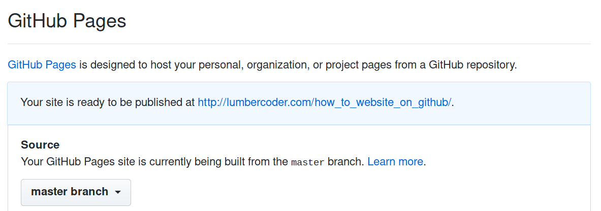

# How to host your site on github

You can use [Github Pages](https://pages.github.com/) to store and host simple HTML sites.

Simply clone this repo, or create a new repo and add a file called `index.html`.

Then activate the github pages on the repository Settings and pick the master branch as the source.

Then go to the link on that page (The one for this repo is: http://lumbercoder.com/how_to_website_on_github/) and you now have a website!
